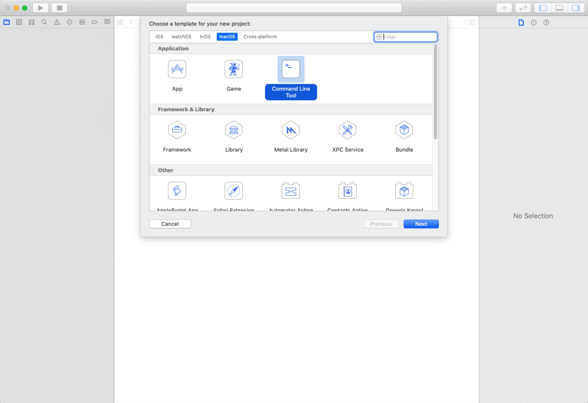
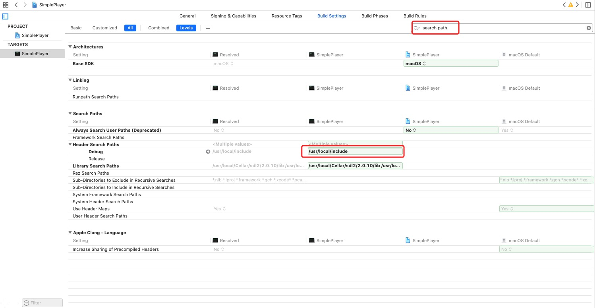
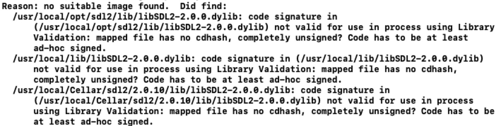
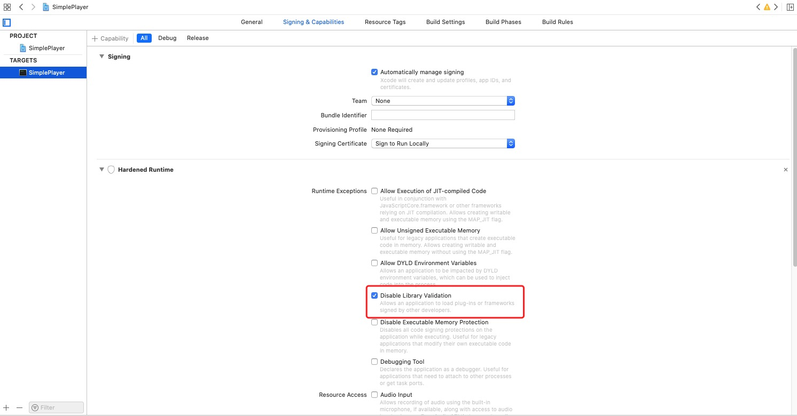

本文是实现在MacOS上ffmpeg+SDL2的简易播放器, 踩了一些坑, 特此记录

<!--more-->

现在网上这个播放器很多都是在windows下运行的, 本人的使用的是macOS, 故想在本系统下实现以下

代码来源于[雷神](https://blog.csdn.net/leixiaohua1020/article/details/38868499), respect!

```c++ 简易播放器源码
#include <stdio.h>

#define __STDC_CONSTANT_MACROS

#ifdef _WIN32
//Windows
extern "C"
{
#include "libavcodec/avcodec.h"
#include "libavformat/avformat.h"
#include "libswscale/swscale.h"
#include "libavutil/imgutils.h"
#include "SDL2/SDL.h"
};
#else
//Linux...
#ifdef __cplusplus
extern "C"
{
#endif
#include <libavcodec/avcodec.h>
#include <libavformat/avformat.h>
#include <libswscale/swscale.h>
#include <SDL2/SDL.h>
#include <libavutil/imgutils.h>
#ifdef __cplusplus
};
#endif
#endif

//Output YUV420P data as a file
#define OUTPUT_YUV420P 0

int main(int argc, char* argv[])
{
    AVFormatContext    *pFormatCtx;
    int                i, videoindex;
    AVCodecContext    *pCodecCtx;
    AVCodec            *pCodec;
    AVFrame    *pFrame,*pFrameYUV;
    unsigned char *out_buffer;
    AVPacket *packet;
    int y_size;
    int ret, got_picture;
    struct SwsContext *img_convert_ctx;

    char filepath[]="视频数据";
    // 换成你本地的视频
    //SDL---------------------------
    int screen_w=0,screen_h=0;
    SDL_Window *screen;
    SDL_Renderer* sdlRenderer;
    SDL_Texture* sdlTexture;
    SDL_Rect sdlRect;

    FILE *fp_yuv;

    av_register_all();
    avformat_network_init();
    pFormatCtx = avformat_alloc_context();

    if(avformat_open_input(&pFormatCtx,filepath,NULL,NULL)!=0){
        printf("Couldn't open input stream.\n");
        return -1;
    }
    if(avformat_find_stream_info(pFormatCtx,NULL)<0){
        printf("Couldn't find stream information.\n");
        return -1;
    }
    videoindex=-1;
    for(i=0; i<pFormatCtx->nb_streams; i++)
        if(pFormatCtx->streams[i]->codec->codec_type==AVMEDIA_TYPE_VIDEO){
            videoindex=i;
            break;
        }
    if(videoindex==-1){
        printf("Didn't find a video stream.\n");
        return -1;
    }

    pCodecCtx=pFormatCtx->streams[videoindex]->codec;
    pCodec=avcodec_find_decoder(pCodecCtx->codec_id);
    if(pCodec==NULL){
        printf("Codec not found.\n");
        return -1;
    }
    if(avcodec_open2(pCodecCtx, pCodec,NULL)<0){
        printf("Could not open codec.\n");
        return -1;
    }

    pFrame=av_frame_alloc();
    pFrameYUV=av_frame_alloc();
    out_buffer=(unsigned char *)av_malloc(av_image_get_buffer_size(AV_PIX_FMT_YUV420P,  pCodecCtx->width, pCodecCtx->height,1));
    av_image_fill_arrays(pFrameYUV->data, pFrameYUV->linesize,out_buffer,
        AV_PIX_FMT_YUV420P,pCodecCtx->width, pCodecCtx->height,1);

    packet=(AVPacket *)av_malloc(sizeof(AVPacket));
    //Output Info-----------------------------
    printf("--------------- File Information ----------------\n");
    av_dump_format(pFormatCtx,0,filepath,0);
    printf("-------------------------------------------------\n");
    img_convert_ctx = sws_getContext(pCodecCtx->width, pCodecCtx->height, pCodecCtx->pix_fmt,
        pCodecCtx->width, pCodecCtx->height, AV_PIX_FMT_YUV420P, SWS_BICUBIC, NULL, NULL, NULL);

#if OUTPUT_YUV420P
    fp_yuv=fopen("output.yuv","wb+");
#endif

    if(SDL_Init(SDL_INIT_VIDEO | SDL_INIT_AUDIO | SDL_INIT_TIMER)) {
        printf( "Could not initialize SDL - %s\n", SDL_GetError());
        return -1;
    }

    screen_w = pCodecCtx->width;
    screen_h = pCodecCtx->height;
    //SDL 2.0 Support for multiple windows
    screen = SDL_CreateWindow("Simplest ffmpeg player's Window", SDL_WINDOWPOS_UNDEFINED, SDL_WINDOWPOS_UNDEFINED,
        screen_w, screen_h,
        SDL_WINDOW_OPENGL);

    if(!screen) {
        printf("SDL: could not create window - exiting:%s\n",SDL_GetError());
        return -1;
    }

    sdlRenderer = SDL_CreateRenderer(screen, -1, 0);
    SDL_RendererInfo rendererInfo;
    SDL_GetRendererInfo(sdlRenderer, &rendererInfo);
    printf("Renderinfo++++++++++++++++++++++++++:%s--%s\n",SDL_GetCurrentVideoDriver(),rendererInfo.name);
    //IYUV: Y + U + V  (3 planes)
    //YV12: Y + V + U  (3 planes)
    sdlTexture = SDL_CreateTexture(sdlRenderer, SDL_PIXELFORMAT_IYUV, SDL_TEXTUREACCESS_STREAMING,pCodecCtx->width,pCodecCtx->height);

    sdlRect.x=0;
    sdlRect.y=0;
    sdlRect.w=screen_w;
    sdlRect.h=screen_h;

    //SDL End----------------------
    while(av_read_frame(pFormatCtx, packet)>=0){
        if(packet->stream_index==videoindex){
            ret = avcodec_decode_video2(pCodecCtx, pFrame, &got_picture, packet);
            if(ret < 0){
                printf("Decode Error.\n");
                return -1;
            }
            if(got_picture){
                sws_scale(img_convert_ctx, (const unsigned char* const*)pFrame->data, pFrame->linesize, 0, pCodecCtx->height,
                    pFrameYUV->data, pFrameYUV->linesize);

#if OUTPUT_YUV420P
                y_size=pCodecCtx->width*pCodecCtx->height;
                fwrite(pFrameYUV->data[0],1,y_size,fp_yuv);    //Y
                fwrite(pFrameYUV->data[1],1,y_size/4,fp_yuv);  //U
                fwrite(pFrameYUV->data[2],1,y_size/4,fp_yuv);  //V
#endif
                //SDL---------------------------
#if 0
                SDL_UpdateTexture( sdlTexture, NULL, pFrameYUV->data[0], pFrameYUV->linesize[0] );
#else
                SDL_UpdateYUVTexture(sdlTexture, &sdlRect,
                pFrameYUV->data[0], pFrameYUV->linesize[0],
                pFrameYUV->data[1], pFrameYUV->linesize[1],
                pFrameYUV->data[2], pFrameYUV->linesize[2]);
#endif

                SDL_RenderClear( sdlRenderer );
                SDL_RenderCopy( sdlRenderer, sdlTexture,  NULL, &sdlRect);
                SDL_RenderPresent( sdlRenderer );
                //SDL End-----------------------
                //Delay 40ms
                SDL_Delay(40);
                // 不加这个事件可以正确解析视频, 但是无法显示窗口渲染!!!
                // 一定要加这个.
                SDL_Event event;
                if (SDL_PollEvent(&event)) {
                     printf("event is %#x\n", event.type); // test code
                     if (SDL_QUIT == event.type) {
                          printf("SDL2 qui\n");
                          break;
                     }
                }
            }
        }
        av_free_packet(packet);
    }
    sws_freeContext(img_convert_ctx);

#if OUTPUT_YUV420P
    fclose(fp_yuv);
#endif

    SDL_Quit();

    av_frame_free(&pFrameYUV);
    av_frame_free(&pFrame);
    avcodec_close(pCodecCtx);
    avformat_close_input(&pFormatCtx);

    return 0;
}
```

本文只说怎么让上面的代码在macOS(本机版本为10.15)上跑起来. 具体的原理后面有时间会再写博文..

打开xcode, 新建command line tool



我选择的是c(c++也行)

然后肯定会报头文件不存在的错误, 此时你需要安装ffmpeg和sdl2, 直接通过homebrew 安装即可

安装好后按照下面的图片进行操作, 填入头文件搜索的位置



然后还得导入相关的库文件才行, 直接在/usr/local/Celler下面找到对应的ffmpeg和sdl2, 进入lib文件将相关的.dylib 直接丢到工程里即可, 丢的时候直接选择create folder references就行

然后顺利的话就能运行了, 注意播放的文件地址替换. 

**下面是我遇到的两个坑!**<br>
* 如果遇到报如下错误



这个错误困扰了我好久好久... 网上也是各种方法都试了, 什么重装sdl2, 重装homebrew, 都没用.. 最后另一个github工程的[issue](https://github.com/opencv/opencv/issues/15645)中发现了一些老哥在讨论这个事情, 给出了解决方案, 我一试就OK了, 真的是惨啊..



* 首先就是sdl2无法显示窗口, 看后台输出数据是正确解析了视频的, 但是窗口就是不显示出来, 后面是发现得加sdl的事件!, 不知道为什么windows上不加也可以.. 代码我已经加到上面的代码中了.

注意: 上面只是一个简单的播放器, 也只有播放功能, 没有音频输出. 后续可以完善. 但也算是解析视频的步骤也是很全的, 算是入门播放器


